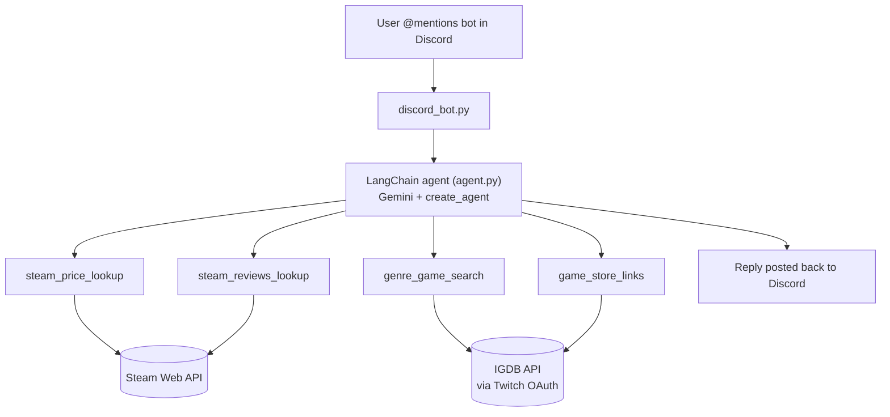

# Game Price & Discovery Chatbot

A LangChain-powered chatbot that answers natural-language questions about
video games — Steam prices and discounts, review standing, genre-based
recommendations, and where to buy a game across platforms (Steam, GOG,
PlayStation Store, Nintendo eShop). Runs live in Discord, deployed on a
GCP VM.

## Why this exists

Built as a portfolio project to get hands-on with LangChain's current
agent APIs (`create_agent`, tool-calling, middleware, conversation
memory) and to practice cloud deployment outside AWS. Steam, Gemini,
IGDB (via Twitch OAuth), Discord, Docker, and Terraform on GCP are all
wired together end to end.

## Architecture



The agent decides which tool(s) to call based on the question — a price
question hits Steam directly; "what are some good RPGs" triggers a
genre search against IGDB, cross-checked against real store links so
recommendations always point to something actually purchasable.

## Features

- **Steam price & discount lookup** — real-time, with disk-cached catalog
  data so repeat runs don't re-fetch Steam's ~185k-game list every time
- **Steam review summaries** (e.g. "Very Positive")
- **Genre-based recommendations** via IGDB, filtered to games with a
  minimum rating count (avoids single-review outliers) and cross-checked
  against real storefront links
- **Cross-platform store links** — Steam, GOG, PlayStation Store,
  Nintendo eShop
- **Conversation memory** — follow-up questions like "what about the
  sequel?" resolve using per-user chat history
- **Unreleased-game handling** — reports release dates instead of
  incorrectly saying a game "wasn't found"
- Runs as a **Discord bot**, deployed on a **GCP e2-micro VM** via
  Terraform + Docker

## Add it to your own server

[Click here to invite the bot](https://discord.com/oauth2/authorize?client_id=1547775745219108935)

Once added, @mention it in any channel it can see — e.g. `@YourBotName how much is Hades?`

## Tech stack

| Layer | Tool |
|---|---|
| Agent framework | LangChain (`create_agent`, current v1 API) |
| LLM | Google Gemini (free tier) |
| Game data | Steam Web API, IGDB (Twitch OAuth) |
| Chat interface | discord.py |
| Infra | Terraform, Docker, GCP Compute Engine |

## Setup

### 1. API keys

Create a `.env` file in the project root:

```
STEAM_API_KEY=your_key
GOOGLE_API_KEY=your_key
TWITCH_CLIENT_ID=your_id
TWITCH_CLIENT_SECRET=your_secret
DISCORD_BOT_TOKEN=your_token
```

- Steam: https://steamcommunity.com/dev/apikey
- Gemini (Google AI Studio, no card required): https://aistudio.google.com/apikey
- Twitch/IGDB: https://dev.twitch.tv/console/apps/create
- Discord: https://discord.com/developers/applications — remember to
  enable **Message Content Intent** under the Bot tab

### 2. Install dependencies

```
pip install -r requirements.txt
```

### 3. Run locally

```
python discord_bot.py
```

### 4. Deploy (optional)

See `terraform/main.tf` for provisioning a free-tier GCP VM, and the
`Dockerfile` for containerizing the bot. Secrets are passed as
environment variables at `docker run` time — never baked into the image.

## Notable bugs found & fixed along the way

A few of these turned into genuinely interesting debugging exercises,
worth mentioning since they're more instructive than "it just worked":

- **Fuzzy-matching false positive**: a naive `difflib` match resolved
  "Dark Souls" to an unrelated game ("Soulbaby: Remastered") purely on
  shared characters. Fixed with a stricter exact → prefix-match → fuzzy
  fallback hierarchy.
- **Model reliability gap**: the LLM sometimes skipped tool calls
  entirely for "well-known" facts (stating an outdated Dark Souls
  price from memory). Fixed with a `wrap_model_call` middleware that
  forces a tool call on the first turn of every user message.
- **Deterministic vs. prompted reasoning**: even with explicit prompt
  instructions, the model misreported an unreleased game as "not
  found" instead of correctly noting its release date. Fixed by moving
  that reasoning into a `status_message` field built in code, rather
  than relying on the model to correctly interpret several raw fields
  at once.
- **IGDB duplicate entries**: IGDB can have multiple database entries
  for the same game; its search relevance ranking doesn't guarantee the
  most complete entry comes back first. Fixed by fetching several
  candidates and keeping whichever has the most confirmed store links.
- **No plain "Action" genre in IGDB** — its taxonomy is more granular
  than Steam/RAWG (Shooter, Platform, Hack-and-slash, etc. instead of
  one broad bucket), requiring a casual-term-to-real-genre mapping.

## License

MIT
